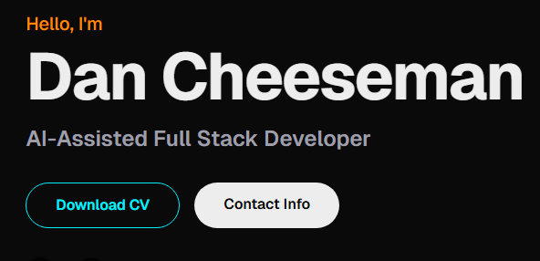

# Dan Cheeseman | AI-Assisted Full Stack Portfolio

**Live Demo:** [https://danichese.github.io](https://danichese.github.io)



## 🚀 The Mission: From Static to Dynamic with AI

This project represents a complete architectural overhaul of my personal portfolio. The goal was to migrate from a legacy static HTML site to a modern, scalable Next.js application, leveraging the power of **AI-Assisted Development** to accelerate every stage of the lifecycle.

### 🔄 Migration: Before vs. After

| Feature | **Before (Legacy)** | **After (Modern)** |
| :--- | :--- | :--- |
| **Architecture** | Static HTML/CSS/JS | **Next.js 15+ (React)** |
| **Styling** | Vanilla CSS | **Tailwind CSS v4** |
| **Language** | JavaScript | **TypeScript (Strict)** |
| **Deployment** | Manual Upload | **GitHub Actions CI/CD** |
| **Maintainability** | Low (Duplicated code) | **High (Component-based)** |
| **CV Management** | Static PDF File | **Live Markdown Rendering + PDF Gen** |

---

## 🛠️ Technology Stack

This project is built on a robust, industry-standard stack designed for performance, SEO, and developer experience.

-   **Framework:** [Next.js](https://nextjs.org/) (App Router)
-   **Language:** [TypeScript](https://www.typescriptlang.org/)
-   **Styling:** [Tailwind CSS v4](https://tailwindcss.com/)
-   **Icons:** [Lucide React](https://lucide.dev/)
-   **Markdown Rendering:** `react-markdown` (for the live CV)
-   **Testing:** Jest + React Testing Library
-   **Deployment:** GitHub Pages via GitHub Actions

---

## 🤖 The AI-Assisted Workflow

This project is more than just code; it's a demonstration of how a **"Human-in-the-Loop"** AI workflow can drastically reduce development time while maintaining high quality.

**Tools Used:**
-   **Gemini CLI:** For rapid code generation, refactoring, and shell command orchestration.
-   **Conductor:** A spec-driven development methodology used to plan, track, and verify every feature.
-   **VS Code:** The IDE environment where AI and human developer collaborate.

**How it was built:**
1.  **Spec-Driven Development:** Every feature started as a `spec.md` definition, ensuring clear requirements before a single line of code was written.
2.  **Automated Scaffolding:** The Gemini CLI handled the boilerplate setup, file creation, and initial implementation of components.
3.  **Iterative Refactoring:** The AI agent audited the codebase, proposed structural improvements, and refactored large files into reusable components.
4.  **Verification:** Automated tests were generated alongside the code, ensuring every feature (from the Navbar to the Markdown CV) works as expected.

---

## 📂 Project Structure

```bash
src/
├── app/
│   ├── globals.css      # Global styles & Tailwind config
│   ├── layout.tsx       # Root layout with SEO metadata
│   └── page.tsx         # Home page composition
├── components/
│   ├── MarkdownCV.tsx   # Live CV renderer
│   ├── Navbar.tsx       # Responsive navigation
│   ├── ProjectCard.tsx  # Reusable project showcase card
│   └── sections/        # Page sections (Hero, About, Projects, etc.)
└── ...
```

---

## 🧪 Running Tests

This project enforces code quality through a comprehensive Jest test suite.

```bash
# Run all tests
npm test

# Run tests in watch mode
npm test -- --watch
```

## 🚀 Getting Started

1.  **Clone the repository:**
    ```bash
    git clone https://github.com/danichese/portfolio-site.git
    ```
2.  **Install dependencies:**
    ```bash
    npm install
    ```
3.  **Run the development server:**
    ```bash
    npm run dev
    ```
4.  **Open:** [http://localhost:3000](http://localhost:3000)

---

**Built with ❤️ and 🤖 by Dan Cheeseman**